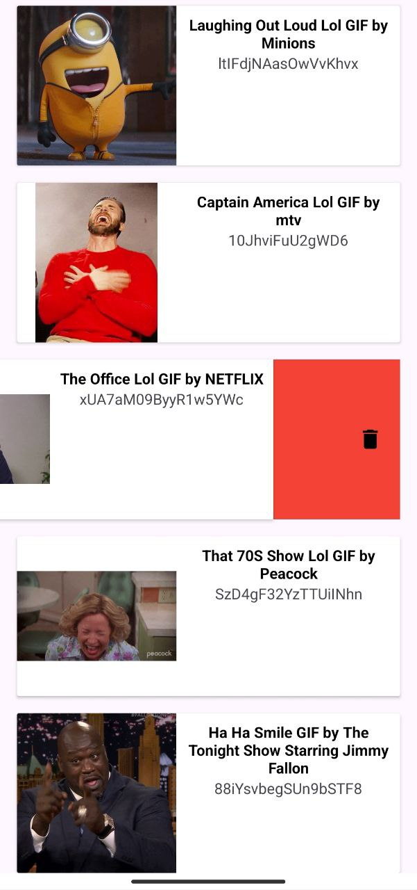

# RecyclerView Example with Swipe and Drag and drop

Aplicación que muestra una lista de elementos, ente caso gifs, sobre los cuales se pueden realizar gestos como deslizar (izquierda o derecha) y arrastrar y soltar.

## Tabla de Contenidos

- [RecyclerView Example with Swipe and Drag and drop](#recyclerview-example-with-swipe-and-drag-and-drop)
    - [Tabla de Contenidos](#tabla-de-contenidos)
    - [Características](#características)
    - [Screenshots](#screenshots)
    - [Instalación](#instalación)


## Características

Este proyecto incluye las siguientes funcionalidades:

- **View Binding**: Enlace eficiente de vistas para evitar llamadas repetitivas a `findViewById()`, mejorando la seguridad de tipos y la legibilidad del código.
- **ViewModel**: Manejo de la UI y lógica de negocio utilizando el patrón MVVM, permitiendo la persistencia de datos frente a cambios de configuración.
- **Kotlin Coroutines**: Manejo de operaciones asíncronas de manera eficiente y estructurada, como la obtención de datos desde la red o el acceso a bases de datos.
- **LiveData**: Observación de cambios de datos en la UI en tiempo real, utilizando LiveData para flujos reactivos.
- **Retrofit**: Realización de llamadas HTTP para consumir APIs REST, con un manejo eficiente de respuestas y errores.
- **ConstraintLayout**: Diseño flexible y optimizado que permite la creación de interfaces complejas con mejor rendimiento en diversas resoluciones de pantalla.
- **Carga de Imágenes (Glide)**: Carga y gestión eficiente de imágenes en la aplicación, reduciendo el uso de memoria y mejorando el rendimiento de la UI.
- **RecyclerView**: Renderizado eficiente de listas y manejo dinámico de elementos de gran tamaño.
- **Drag and Drop / Swipe y Move**: Funcionalidades avanzadas de interacción de usuarios, como arrastrar y soltar elementos o gestos de swipe para eliminar o mover.


## Screenshots

<h3 align="center">Aquí algunas capturas de pantalla de la aplicación:</h3>

<table>
<td width="50%">
<div align="center">



</div>                                                                       
</td>                                                         
</table>                                                                                 

## Instalación

1. Clona este repositorio:
   ```bash
   git clone https://github.com/CarlosSala/kotlinRecyclerViewExample.git```

1. Obtén tu propia API Key registrándote en [Giphy](https://giphy.com/).
2. Una vez obtengas la API Key, agrégala en un archivo llamado `apiKey.properties` en la raíz de tu proyecto.
3. Dentro del archivo `apiKey.properties`, añade la siguiente línea:

   ```bash
   API_KEY=tu_api_key_aqui